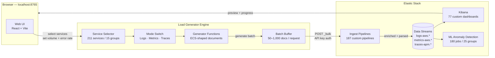
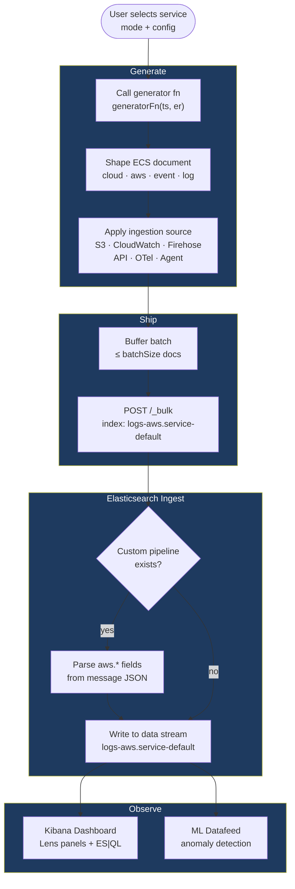
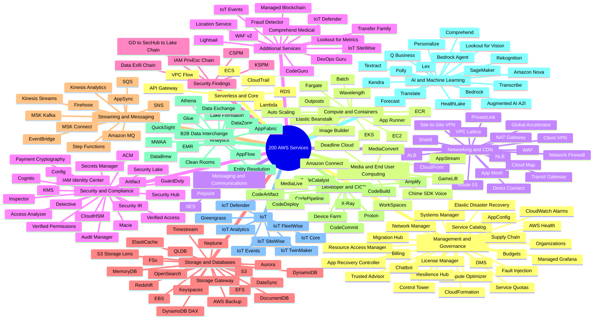
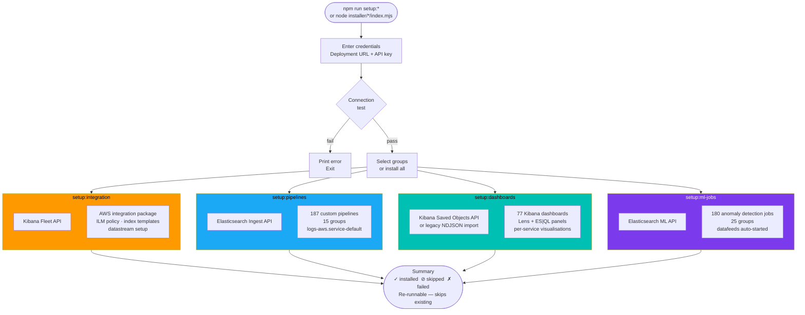

# AWS Elastic Load Generator — Architecture Diagrams

---

## 1 · System Architecture

```mermaid
flowchart LR
    subgraph Browser["Browser — localhost:8765"]
        UI["Web UI\nReact + Vite"]
    end

    subgraph Engine["Load Generator Engine"]
        SEL["Service Selector\n211 services / 15 groups"]
        MODE["Mode Switch\nLogs · Metrics · Traces"]
        GEN["Generator Functions\nECS-shaped documents"]
        BUF["Batch Buffer\n50–1,000 docs / request"]
    end

    subgraph Elastic["Elastic Stack"]
        PIPE["Ingest Pipelines\n187 custom pipelines"]
        DS[("Data Streams\nlogs-aws.*\nmetrics-aws.*\ntraces-apm.*")]
        KB["Kibana\n77 custom dashboards"]
        ML["ML Anomaly Detection\n180 jobs / 25 groups"]
    end

    UI -->|"select services\nset volume + error rate"| SEL
    SEL --> MODE
    MODE --> GEN
    GEN -->|"generate batch"| BUF
    BUF -->|"POST _bulk\nAPI key auth"| PIPE
    PIPE -->|"enriched + parsed"| DS
    DS --> KB
    DS --> ML
    KB -->|"preview + progress"| Browser
```

---

## 2 · Document Data Flow

```mermaid
flowchart TD
    A(["User selects service\nmode + config"]) --> B

    subgraph Generate["Generate"]
        B["Call generator fn\ngeneratorFn(ts, er)"]
        C["Shape ECS document\ncloud · aws · event · log"]
        D["Apply ingestion source\nS3 · CloudWatch · Firehose\nAPI · OTel · Agent"]
    end

    B --> C --> D

    subgraph Ship["Ship"]
        E["Buffer batch\n≤ batchSize docs"]
        F["POST /_bulk\nindex: logs-aws.service-default"]
    end

    D --> E --> F

    subgraph Ingest["Elasticsearch Ingest"]
        G{"Custom pipeline\nexists?"}
        H["Parse aws.* fields\nfrom message JSON"]
        I["Write to data stream\nlogs-aws.service-default"]
    end

    F --> G
    G -->|"yes"| H --> I
    G -->|"no"| I

    subgraph Observe["Observe"]
        J["Kibana Dashboard\nLens panels + ES|QL"]
        K["ML Datafeed\nanomaly detection"]
    end

    I --> J
    I --> K

    style Generate fill:#1e3a5f,color:#fff
    style Ship fill:#1e3a5f,color:#fff
    style Ingest fill:#1e3a5f,color:#fff
    style Observe fill:#1e3a5f,color:#fff
```

---

## 3 · Service Groups (211 services)

```mermaid
mindmap
  root((200 AWS Services))
    Serverless and Core
      Lambda
      API Gateway
      VPC Flow
      CloudTrail
      RDS
      ECS
    Compute and Containers
      EC2
      Outposts
      Wavelength
      EKS
      Fargate
      ECR
      App Runner
      Batch
      Elastic Beanstalk
      Auto Scaling
      Image Builder
    Networking and CDN
      ALB
      NLB
      CloudFront
      WAF
      Route 53
      Network Firewall
      Shield
      Global Accelerator
      Transit Gateway
      Direct Connect
      Site-to-Site VPN
      PrivateLink
      NAT Gateway
      VPC Lattice
      App Mesh
      Client VPN
      Cloud Map
    Security and Compliance
      GuardDuty
      Security Hub
      Macie
      Inspector
      Config
      Access Analyzer
      Cognito
      KMS
      Secrets Manager
      ACM
      IAM Identity Center
      Detective
      Verified Access
      Security Lake
      Security IR
      CloudHSM
      Audit Manager
      Verified Permissions
      Payment Cryptography
      Artifact
    Security Findings
      GD to SecHub to Lake Chain
      CSPM
      KSPM
      IAM PrivEsc Chain
      Data Exfil Chain
    Storage and Databases
      S3
      S3 Storage Lens
      EFS
      FSx
      EBS
      AWS Backup
      DataSync
      Storage Gateway
      DynamoDB
      Aurora
      ElastiCache
      MemoryDB
      Redshift
      OpenSearch
      DocumentDB
      Neptune
      Timestream
      QLDB
      DynamoDB DAX
      Keyspaces
    Streaming and Messaging
      Kinesis Streams
      Firehose
      Kinesis Analytics
      MSK Kafka
      SQS
      SNS
      Amazon MQ
      EventBridge
      Step Functions
      AppSync
      MSK Connect
    Developer and CICD
      CodeBuild
      CodePipeline
      CodeDeploy
      CodeCommit
      CodeArtifact
      Amplify
      X-Ray
      CodeCatalyst
      Device Farm
      Proton
    Analytics
      EMR
      Glue
      Athena
      Lake Formation
      QuickSight
      DataBrew
      AppFlow
      MWAA
      Clean Rooms
      DataZone
      Entity Resolution
      Data Exchange
      AppFabric
      B2B Data Interchange
    AI and Machine Learning
      SageMaker
      Bedrock
      Bedrock Agent
      Rekognition
      Textract
      Comprehend
      Translate
      Transcribe
      Polly
      Forecast
      Personalize
      Lex
      Q Business
      Kendra
      Augmented AI A2I
      HealthLake
      Amazon Nova
      Lookout for Vision
    IoT
      IoT Core
      Greengrass
      IoT Analytics
      IoT TwinMaker
      IoT FleetWise
      IoT Events
      IoT SiteWise
      IoT Defender
    Management and Governance
      CloudFormation
      Systems Manager
      CloudWatch Alarms
      AWS Health
      Trusted Advisor
      Control Tower
      Organizations
      Service Catalog
      Service Quotas
      Compute Optimizer
      Budgets
      Billing
      Resource Access Manager
      Resilience Hub
      Migration Hub
      Network Manager
      DMS
      Fault Injection
      Managed Grafana
      Supply Chain
      App Recovery Controller
      AppConfig
      Elastic Disaster Recovery
      License Manager
      Chatbot
    Media and End User Computing
      MediaConvert
      MediaLive
      WorkSpaces
      Amazon Connect
      AppStream
      GameLift
      Deadline Cloud
      Chime SDK Voice
    Messaging and Communications
      SES
      Pinpoint
    Additional Services
      Transfer Family
      Lightsail
      Fraud Detector
      Lookout for Metrics
      Comprehend Medical
      Location Service
      Managed Blockchain
      CodeGuru
      DevOps Guru
      WAF v2
      IoT Events
      IoT SiteWise
      IoT Defender
```

---

## 4 · Installer Flow

```mermaid
flowchart TD
    START(["npm run setup:*\nor node installer/*/index.mjs"]) --> AUTH

    AUTH["Enter credentials\nDeployment URL + API key"]
    AUTH --> TEST{"Connection\ntest"}
    TEST -->|"fail"| ERR1["Print error\nExit"]
    TEST -->|"pass"| MENU["Select groups\nor install all"]

    MENU --> I1 & I2 & I3 & I4

    subgraph I1["setup:integration"]
        direction TB
        A1["Kibana Fleet API"]
        A2["AWS integration package\nILM policy · index templates\ndatastream setup"]
    end

    subgraph I2["setup:pipelines"]
        direction TB
        B1["Elasticsearch Ingest API"]
        B2["187 custom pipelines\n15 groups\nlogs-aws.service-default"]
    end

    subgraph I3["setup:dashboards"]
        direction TB
        C1["Kibana Saved Objects API\nor legacy NDJSON import"]
        C2["77 Kibana dashboards\nLens + ES|QL panels\nper-service visualisations"]
    end

    subgraph I4["setup:ml-jobs"]
        direction TB
        D1["Elasticsearch ML API"]
        D2["180 anomaly detection jobs\n25 groups\ndatafeeds auto-started"]
    end

    I1 --> DONE
    I2 --> DONE
    I3 --> DONE
    I4 --> DONE

    DONE(["Summary\n✓ installed  ⊘ skipped  ✗ failed\nRe-runnable — skips existing"])

    style I1 fill:#FF9900,color:#000
    style I2 fill:#1BA9F5,color:#000
    style I3 fill:#00BFB3,color:#000
    style I4 fill:#7C3AED,color:#fff
```
